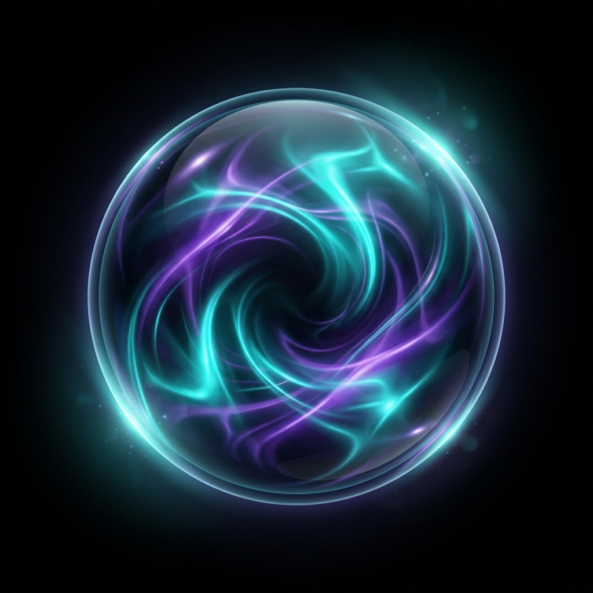

<p align="center">
  
</p>

<h1 align="center">Nikhil's Personal YT Extension</h1>

<p align="center">
  A minimalist Chrome extension that transforms YouTube into an immersive, theater-like experience with real-time ambient glow, transparent UI, and a distraction-free layout.
</p>

<p align="center">
  
  
  
</p>

---

## 🌌 Ambient Glow Engine

The core glow engine samples colors from the video edges in real-time and projects them as smooth radial gradients across the entire page, creating an immersive, theater-like atmosphere.

* **Dual-Zone Projection**: Features screen-wide ambient backdrop illumination paired with a player-anchored edge-hugging glow halo.
* **Compositor Layer Isolation**: Projects glow passes directly onto the GPU (`transform: translate3d`) preventing page redraws.
* **Framerate Synchronized**: Leverages a 30 FPS pacing cycle to ensure zero CPU overhead and maximum battery efficiency.

---

## ✨ Features

- 🌈 **Ambient Glow Engine**  
  Samples video frames in real-time and projects dynamic radial color washes behind the page using GPU acceleration.
- 🎥 **Cinematic Transparent UI**  
  Makes the YouTube masthead, sidebar navigation, comments, and related panels transparent with premium glassmorphism.
- 🔍 **Minimalist Search**  
  Collapses the search bar into a single icon. Press <kbd>S</kbd> to focus, and <kbd>Esc</kbd> to close.
- ⚡ **GPU-Accelerated**  
  Offscreen canvas downsampling and inline CSS-filters bypass CPU readbacks entirely, ensuring 60fps-equivalent rendering.
- 🎛️ **Popup Control Panel**  
  Premium dashboard styled with glassmorphism to toggle individual features on-the-fly.
- 💾 **Persistent Settings**  
  Real-time settings sync using `chrome.storage.local` across multiple YouTube tabs.

---

## 🚀 Installation

### Load Unpacked (Developer Mode)

1. Clone or download this repository.
2. Open Google Chrome and navigate to:
   ```text
   chrome://extensions/
   ```
3. Enable **Developer Mode** by toggling the switch in the top-right corner.
4. Click **Load unpacked** in the top-left.
5. Select this project folder.
6. Open [YouTube](https://www.youtube.com) and start watching a video! 🎬

---

## 🎮 Usage

### Keyboard Shortcuts

* Press <kbd>S</kbd> on any YouTube page (when not typing in a text field) to **expand and focus the search bar**.
* Press <kbd>Esc</kbd> or click anywhere outside to **collapse the search bar**.

### Control Settings

* Click the extension icon in the toolbar to access the **Control Panel**.
* Toggle **Ambient Glow Engine**, **Cinematic Transparent UI**, or **Minimalist Search** settings in real-time.
* The popup footer shows a live status indicator:
  - <span style="color:#10b981;">●</span> **Active on YouTube** (green)
  - <span style="color:#6b7280;">●</span> **Open YouTube** (gray link)

---

## 🏗️ Project Structure

```text
Nikhil's personal yt extension/
├── manifest.json          # Chrome Extension manifest (V3)
├── background.js          # Service worker — initializes default settings
├── content.js             # Core engine — ambient glow, search, storage sync
├── content.css            # Cinematic styles — transparency, glow canvas, search collapse
├── popup.html             # Extension popup markup
├── popup.css              # Glassmorphic control panel styling
├── popup.js               # Popup logic — settings toggle and live status sync
├── icon.png               # Premium extension icon
└── README.md              # Documentation
```

---

## 📄 License

This project is licensed under the **MIT License**. See the `LICENSE` file for details.
